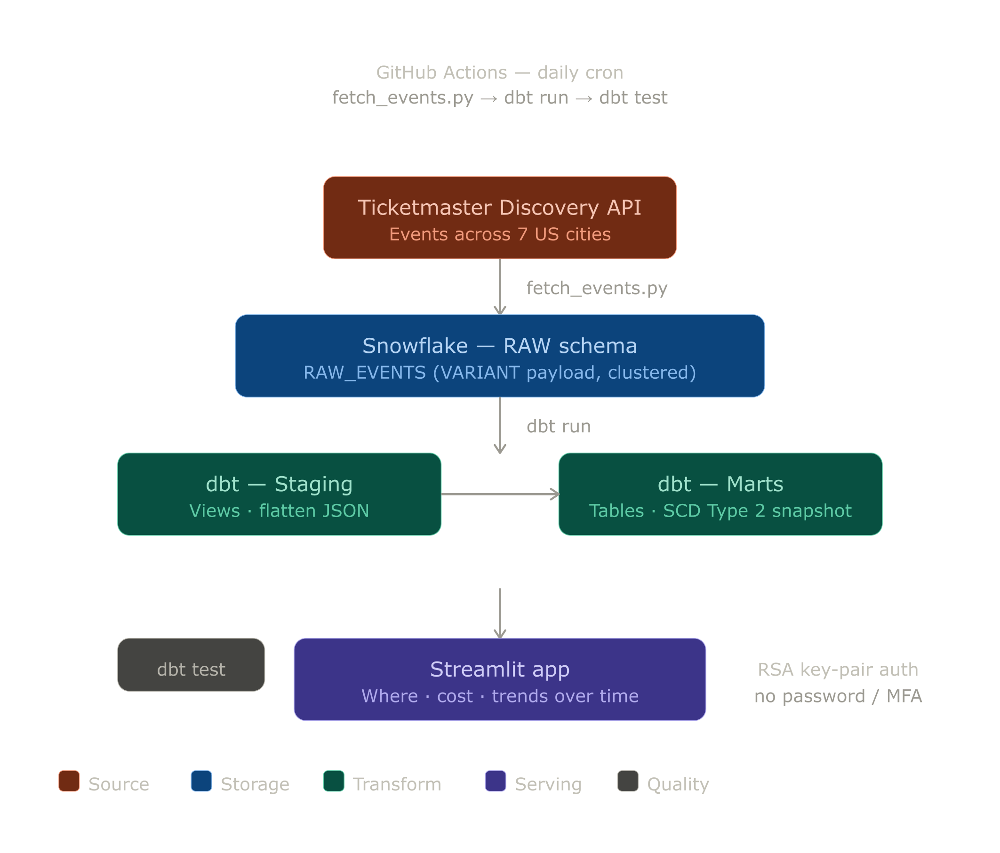
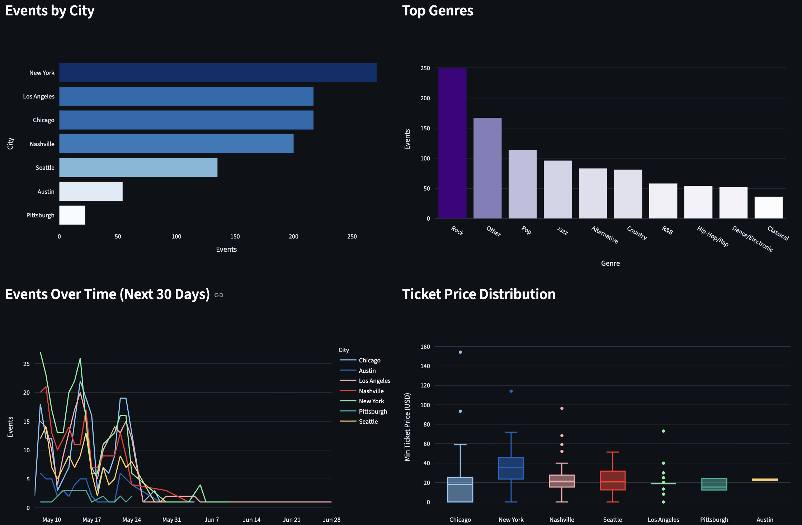

# Ticketmaster Concert Radar

End-to-end data pipeline that ingests, transforms, and visualizes live music events across major U.S. cities to answer: **where are concerts happening, how much do they cost, and how does music scene changes within US cities?**

Built with Snowflake, dbt, and GitHub Actions.

## Table of Contents
- [Infrastructure](#infrastructure)
- [Dashboard](#dashboard)
- [Problem](#problem)
- [Key Findings](#key-findings)
- [Setup](#setup)
- [Further Improvements](#further-improvements)

## Infrastructure

- Data Source — [Ticketmaster Discovery API v2](https://developer.ticketmaster.com/products-and-docs/apis/discovery-api/v2/)
- Data Warehouse — [Snowflake](https://www.snowflake.com)
- Transformation — [dbt](https://www.getdbt.com)
- CI/CD & Orchestration — [GitHub Actions](https://github.com/features/actions)

<p align="center">
    
  </a>
</p>

## Dashboard

<p align="center">
    
  </a>
</p>

## Problem

Ticketmaster publishes event data through a public API, but raw responses are deeply nested JSON — hard to query and impossible to trend over time without a proper pipeline.

This project builds a daily pipeline that ingests music events for 7 U.S. cities, flattens and deduplicates the raw payloads in dbt, and tracks changes in ticket prices and event status across ingestion runs using a SCD Type 2 snapshot model.

## Key Findings

- **Event concentration:** New York, Los Angeles, Chicago, and Nashville together account for more than 80% of all music events in the dataset. Pittsburgh, by contrast, represents less than or around 10% of the event volume seen in any of the three largest markets.

- **Genre identity by city:** Each city has a distinct musical identity. Jazz dominates New York, Country leads Nashville, and Alternative is the top genre in Austin. Most other cities skew toward Rock — with the exception of Pittsburgh, where the most frequent classification is *Other*, suggesting a more fragmented or niche local scene.

- **Ticket pricing gap:** New York consistently has the highest ticket prices across the dataset, while Pittsburgh has the lowest. This aligns with both the size of the markets and the caliber of touring acts each city attracts.

## Setup

### Prerequisites

- [Snowflake account](https://signup.snowflake.com) (free trial works)
- [Ticketmaster developer account](https://developer.ticketmaster.com) with an API key
- Python 3.11+

### 1. Clone the repository
```bash
git clone https://github.com/liviaamaral/ticketmaster-concert-radar.git
cd ticketmaster-concert-radar
```

### 2. Create a virtual environment and install dependencies
```bash
python -m venv .venv
source .venv/bin/activate
pip install -r requirements.txt
```

### 3. Provision Snowflake

Run the following in a Snowsight worksheet to create the database, schemas, warehouse, and raw table:

```sql
USE ROLE ACCOUNTADMIN;

CREATE DATABASE IF NOT EXISTS TICKETMASTER;
CREATE SCHEMA IF NOT EXISTS TICKETMASTER.RAW;
CREATE SCHEMA IF NOT EXISTS TICKETMASTER.STAGING;
CREATE SCHEMA IF NOT EXISTS TICKETMASTER.MARTS;

CREATE WAREHOUSE IF NOT EXISTS TICKETMASTER_WH
    WAREHOUSE_SIZE = 'XSMALL'
    AUTO_SUSPEND = 60
    AUTO_RESUME = TRUE
    INITIALLY_SUSPENDED = TRUE;

USE WAREHOUSE TICKETMASTER_WH;
USE DATABASE TICKETMASTER;
USE SCHEMA RAW;

CREATE TABLE IF NOT EXISTS RAW_EVENTS (
    event_id      STRING        NOT NULL,
    fetched_city  STRING        NOT NULL,
    ingested_at   TIMESTAMP_NTZ NOT NULL,
    payload       VARIANT       NOT NULL
);

ALTER TABLE RAW_EVENTS CLUSTER BY (DATE(ingested_at), fetched_city);
```

### 4. Set up key-pair authentication

dbt and the ingestion script authenticate to Snowflake using RSA key-pair auth (no password / MFA required).

```bash
# Generate the key pair
openssl genrsa -out ~/.ssh/snowflake_key.p8 2048
openssl rsa -in ~/.ssh/snowflake_key.p8 -pubout -out ~/.ssh/snowflake_key.pub
chmod 400 ~/.ssh/snowflake_key.p8

# Copy the public key content (lines between the headers)
cat ~/.ssh/snowflake_key.pub
```

Register the public key on your Snowflake user (Snowsight worksheet):

```sql
ALTER USER YOUR_USER SET RSA_PUBLIC_KEY='<public key content without headers>';
```

### 5. Configure environment variables

```bash
cp .env.example .env
# fill in your values
```

| Variable | Description |
|---|---|
| `TICKETMASTER_API_KEY` | From your Ticketmaster developer account |
| `SNOWFLAKE_ACCOUNT` | Account identifier (e.g. `abc123.us-east-1`) |
| `SNOWFLAKE_USER` | Your Snowflake username |
| `SNOWFLAKE_PRIVATE_KEY_PATH` | Absolute path to `snowflake_key.p8` |
| `SNOWFLAKE_ROLE` | Role to use (default: `ACCOUNTADMIN`) |
| `SNOWFLAKE_WAREHOUSE` | Warehouse name (default: `TICKETMASTER_WH`) |
| `SNOWFLAKE_DATABASE` | Database name (default: `TICKETMASTER`) |
| `SNOWFLAKE_SCHEMA` | Schema for raw landing (default: `RAW`) |

### 6. Run the ingestion

```bash
export $(grep -v '^#' .env | xargs)
python fetch_events.py
```

### 7. Run dbt transformations

```bash
dbt run --profiles-dir .
dbt test --profiles-dir .
```

## Further Improvements

- Expand to more cities
- Add incremental models to reduce Snowflake compute costs

